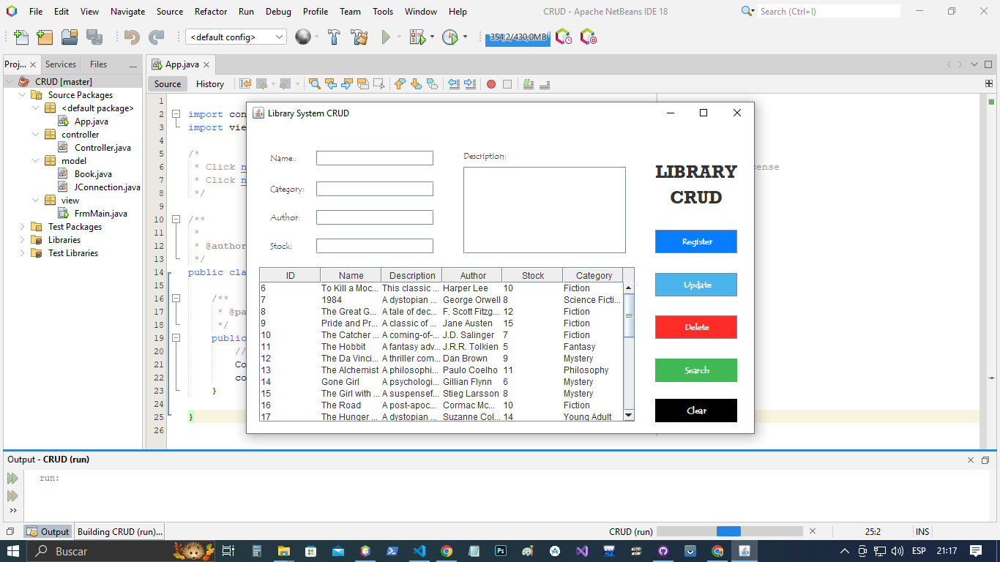
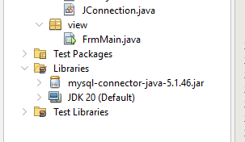
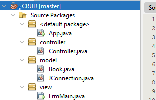

# Java-Library-CRUD
Basic CRUD Java library system example using <b>Java Swing</b> and <b>MySql</b>

 
    <b>Author: </b>LTprograms

<h2>Documentation</h2>

<h3>Intallations</h3>
<h4>Java installation</h4>

To start using this app, you should first have installed java on your computer, you
can install the JDK and JRE using these links:  
JDK: <a target="_blank" href="https://www.oracle.com/pe/java/technologies/downloads/">https://www.oracle.com/pe/java/technologies/downloads/</a> 
JRE: <a target="_blank" href="https://www.java.com/es/download/ie_manual.jsp">https://www.java.com/es/download/ie_manual.jsp</a>

JDK 20 and JRE 8 were used to build this app, in case you have any version problem try to download these software versions or instead try to update the version in configuration files

<h4>NetBeans installation</h4>

This app was built using NetBeans IDE 18, but you can use any other program. Keep in mind some configuration files might cause some issues. However, you can download NetBeans using this link: 
NetBeans IDE: <a target="_blank" href="https://netbeans.apache.org/">https://netbeans.apache.org/</a>

<h4>XAMPP installation</h4>

It was used MySQL as the DBMS (Data Base Managment System), but you can use any other if you want, but remember that every DBMS has its own driver to work with java, so be sure you download the correct driver in the next step. In this case, I used XAMPP 8.0.28, but there is no problem if you download any other version. 
XAMPP: <a target="_blank" href="https://www.apachefriends.org/download.html">https://www.apachefriends.org/download.html</a>

<h4>JDBC installation</h4>

As I mentioned before, you must install the JDBC driver to work with databases, and each DBMS has its own JDBC version, so be sure you install the correct driver if you are using any other DBMS. If you're following me, you can install MySQL JDBC driver in this link, I'm using 5.1.49 version: 
JDBC: <a target="_blank" href="https://downloads.mysql.com/archives/get/p/3/file/mysql-connector-java-5.1.49.zip">https://downloads.mysql.com/archives/get/p/3/file/mysql-connector-java-5.1.49.zip</a>

Once you have installed it, you should include the <i>.jar</i> file in <i>Libraries</i> folder as in the image:

That's all installation you have to do, if you arrive to this point, congratulations, you can keep reading the documentation if you want. In case you had problems in the previous steps, you can contact me or follow any tutorial on YouTube. Good Luck!

<h3>Files and Folders</h3>

I'm using MVC (Model View Controller) architecture, so you will find 3 packages in src folder

<h4>Model</h4>

Here are two classes, <i>Book</i> and <i>JConnection</i>, they are the entities used in this small project

<ul>
<li><b>Book: </b>Class with some attributes such as name(String), author(String), stock(int), category(String), etc. It has its Constructors and getters/setters</li>
<li><b>JConnection: </b>Class to create the connection between the database and the java app. It has some attributes such as user and password, which are the credentials to link the DDBB with our program, in case you have other credentials, just change the variable values to your own ones</li>
</ul>

<h4>View</h4>

It has just one JFrame class to build the GUI (Graphical User Interface), you can adjust the design up to you, or add some other buttons or functionalities.

<h4>Controller</h4>

It's got only one class named Controller, that links the view with the models and set buttons functionalities

<h4>App file</h4>

This is the main class, in case you had any doubts, you can contact me, I left some comments in the code anyway.

